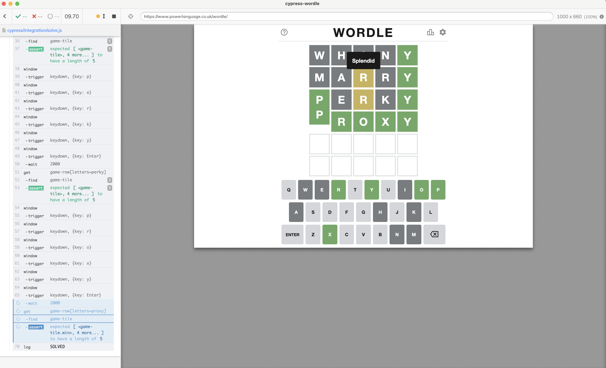

# cypress-wordle

> Solve the Wordle game using Cypress test

## Specs

- [solve.js](./cypress/integration/solve.js) shows a real recursive solution to the Wordle game, watch the video "[Solve Wordle Game For Real Using Cypress](https://youtu.be/zQGLR6qXtq0)".
- [solve-hard-mode.js](./cypress/integration/solve-hard-mode.js) shows how to solve Wordle in Hard mode by optimizing our word picks.
- [spec.js](./cypress/integration/spec.js) takes a shortcut and looks up the solution in the game state object the application saves in the local storage. Watch the video "[Solve Wordle Game Using Cypress](https://www.youtube.com/watch?v=pzFzOKEV-eo)".
- [play-every-day.js](./cypress/integration/play-every-day.js) sets synthetic Date in each test to accumulate a long winning streak playing every word from Jan 1st to Jan 17th 2022. Find the recording [here](https://youtu.be/5X4RuyEoQgY).
